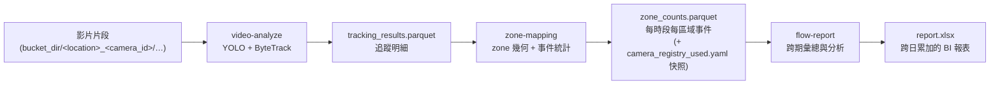

# video-flow-analytics

多路離線影片人流分析系統：以「一天」為單位，將多路攝影機的錄影，透過偵測、追蹤、
區域事件統計、報表彙總，轉換成可長期觀測的人流指標。

## 專案概述

本 repo 是**三個各自獨立的 uv 專案**（非單一套件），對應人流分析的三道處理階段。每包
各帶自己的 `pyproject.toml`／`config.toml`／`uv.lock`／`src/`／`tests/`，可獨立安裝與
執行，彼此**無跨資料夾 import**，只透過 `outputs/` 下的檔案交接：

| 套件 | 職責 | 運算特性 | 進入點 | 詳細文件 |
| --- | --- | --- | --- | --- |
| [`video-analyze/`](video-analyze/README.md) | YOLO 偵測 ＋ ByteTrack 多路追蹤，產出逐格追蹤明細 | GPU、多進程，成本最高 | `analyze_daily` | [README](video-analyze/README.md) |
| [`zone-mapping/`](zone-mapping/README.md) | 把追蹤明細對映到區域幾何，轉成每時段每區域事件統計 | 純 CPU 向量化 | `map_zones_daily` | [README](zone-mapping/README.md) |
| [`flow-report/`](flow-report/README.md) | 跨期間彙總分析，持續寫入單一 Excel 報表供 BI 工具接手 | 純 CPU | `export_report_daily` | [README](flow-report/README.md) |

本 repo 原為單一套件 `src/video_flow_analytics/`，2026-07 拆成上述三包；拆分背景、共用碼
處理方式與設計取捨見
[docs/plans/2026-07-15-split-three-packages.md](docs/plans/2026-07-15-split-three-packages.md)
（issue #18）。**各套件的完整實作細節（模組結構、多進程 pipeline、fail-loud 處理、
演算法、`config.toml` 完整欄位、函式介面）以各自 README 為準**；本檔只提供跨套件的總覽
與共用的資料格式。

資料來源為**本機模擬的 GCS bucket 目錄**，各攝影機的片段依日期分層存放；攝影機清單與
區域定義集中在該 bucket 根目錄下的 `camera_registry.yaml`。

## 系統流程與資料流

三個階段之間**只透過檔案交接**，前一階段的輸出即後一階段的輸入（偵測與追蹤同屬
`video-analyze` 一段、走共享記憶體不落地成檔）：



三個階段共享三個設計原則：

- **階段獨立、可分別重跑**：三段的成本與觸發條件差異很大。只調整區域幾何時，僅需重跑
  `zone-mapping`；只調整報表參數時，僅需重跑 `flow-report`——都不必重跑昂貴的 GPU 偵測。
  這讓日常迭代維持在純 CPU 的低成本路徑上。
- **只靠檔案交接相依**：階段之間不透過記憶體或回傳值傳資料，而是靠 parquet 與 yaml 快照
  交接。下游以「上游輸出檔是否存在」判定相依是否滿足（例如 `zone-mapping` 檢查
  `tracking_results.parquet`）。因此任何排程器都能個別重跑其中一個階段，只要對應的輸入檔
  還在。
- **重跑冪等**：所有輸出都先寫入 `.tmp` 暫存檔、完成後再 `rename` 成正式檔名，藉由
  `rename` 的原子性，確保過程中斷時不會在正式檔名下留下半成品。`flow-report` 對同一天重跑
  是否冪等，取決於 `on_duplicate_date`（見該套件 README）。

**進入點是函式呼叫，CLI 只是外殼。** 三個階段的核心分別是
`analyze_daily`／`map_zones_daily`／`export_report_daily` 三個函式；CLI 只是從各自的
`config.toml` 組出參數後呼叫它們。兩者分離，未來要換掉觸發方式（例如改由 Airflow 驅動）
時，只需替換呼叫這些函式的外殼，pipeline 本身不必更動。

## 環境需求

| 類別 | 需求 |
| --- | --- |
| 執行環境 | Python `>= 3.12`（`.python-version` 釘 `3.12`） |
| 套件管理 | [uv](https://docs.astral.sh/uv/)（安裝與執行皆透過 uv，各包各附 `uv.lock`） |
| GPU | 選用。`video-analyze` 以 `torch.cuda.is_available()` 判斷，無 GPU 時 fallback 到 CPU（明顯變慢）；`zone-mapping` 與 `flow-report` 為純 CPU |
| 系統相依 | FFmpeg / 影像編解碼器（OpenCV 解 `mkv` 等格式）；`lap` 為 C 擴充，環境無對應 wheel 時需要編譯工具鏈 |

各套件的執行期依賴與模型權重說明見各自 README；三包的推理堆疊與輸出格式相關套件版本
**pin 成彼此一致**，避免版本漂移造成非邏輯性的輸出差異。

## 安裝與執行

三包各自 `uv sync`、各自以 `uv run --project <pkg>` 執行，依序產出報表：

```bash
uv sync --project video-analyze && uv sync --project zone-mapping && uv sync --project flow-report

uv run --project video-analyze video-analyze   # 偵測 / 追蹤 → tracking_results.parquet
uv run --project zone-mapping  zone-mapping    # 區域事件統計 → zone_counts.parquet
uv run --project flow-report   flow-report     # 報表彙總 → report.xlsx
```

各命令不接受任何旗標，所有參數都讀自各套件根目錄的 `config.toml`。

> **一律在 repo 根目錄執行**：`bucket_dir` 與各套件的輸出根目錄 `outputs/` 皆為 **cwd
> 相對路徑**，`uv run --project` 不改變 cwd。若改在套件資料夾內執行（`cd zone-mapping
> && …`），`bucket_dir` 會對到不存在的路徑，`outputs/` 也會裂成三棵互不相通的樹，讓
> 階段間的檔案契約失效。各套件自己的 `config.toml` 則以 `__file__` 定位，不受 cwd 影響。

## 設定

設定分成兩類檔案，職責清楚切分：

- **`config.toml`** — 描述「這次要怎麼跑」（哪個 bucket、哪一天、各階段參數）。**每包各有
  一份**，置於各套件根目錄，只含該階段實際讀到的區塊；找不到時會印警告並回退預設值。
  各區塊的完整欄位與約束見各套件 README。
- **`camera_registry.yaml`** — 描述「資料長什麼樣 ＋ 各攝影機的區域定義」。**全 repo 只有
  一份**，放在 `bucket_dir` 根目錄，三包讀同一份實體檔案（格式見下）。

### `camera_registry.yaml`（資料樣貌 ＋ 區域定義）

放在每個 `bucket_dir` 根目錄下，描述該 bucket 的攝影機清單與各攝影機的區域幾何。
**此檔不進版控**（隨 `bucket_name*/` 一起被 `.gitignore` 排除），需依實際部署環境人工維護。

攝影機片段的目錄結構為：

```
<bucket_dir>/<location>_<camera_id>/{YYYY}/{MM}/{DD}/{HHmmss}.{SSS}Z.mkv
```

> **時區處理**：檔名的 `Z` 尾綴依 RFC 3339 為真正的 UTC，`video-analyze` 在
> `io/video_reader.py` 解析時即把它轉換成台北在地時間（`Asia/Taipei`，UTC+8）；此後
> `tracking_results.parquet` 的 `timestamp`、`zone_counts.parquet` 的 `time_bucket`、
> `report.xlsx` 的日期／小時皆為台北在地時間，下游不需要、也不應該再對它做任何 UTC→+8
> 位移。

完整格式範例：

```yaml
bucket_name: bucket_name1

storage:
  file_ext: mkv
  target_codec: h265
  segment_strategy: time
  segment_seconds: 1800

cameras:
  - camera_id: cam001
    location: test
    ip: 192.168.104.115
    participates_in_zone_mapping: true
    zones:
      - name: 平擺桌
        polygon: [[640.01, 866.83], [521.34, 938.8], [700.0, 1000.0]]
```

欄位規範：

| 層級 | 欄位 | 型別 | 預設 | 說明 |
| --- | --- | --- | --- | --- |
| 頂層 | `bucket_name` | str | 必填 | bucket 名稱 |
| | `storage` | 物件 | 必填 | 片段儲存格式參數（見下） |
| | `cameras` | list | 必填 | 攝影機清單 |
| `storage` | `file_ext` | str | `mkv` | 片段副檔名 |
| | `target_codec` | str | `h265` | 原始錄影編碼 |
| | `segment_strategy` | str | `time` | 分段策略 |
| | `segment_seconds` | int | `1800` | 每段秒數，`>= 1` |
| `cameras[]` | `camera_id` | str | 必填 | 攝影機代碼 |
| | `location` | str | 必填 | 地點名稱 |
| | `ip` | str | 必填 | 攝影機 IP |
| | `participates_in_zone_mapping` | bool | `true` | 是否參與區域事件統計 |
| | `zones` | list | `[]` | 該攝影機的區域定義 |
| `zones[]` | `name` | str | 必填 | 區域名稱 |
| | `polygon` | list | 必填 | 區域頂點 `(x, y)` 像素座標清單 |

使用限制（皆為 fail-loud，違反時直接報錯）：

- **`camera_id` 與 `location_camera_id` 皆須唯一**。兩者都是查詢字典的鍵，重複會靜默覆蓋
  其中一筆攝影機，因此在載入時即擋下。
- **`zone` 名稱須全域唯一**——不只同一攝影機內不可重複，跨攝影機也不可重複。因為報表以
  區域名稱（不含 `camera_id`）分組彙總，同名區域會被合併。此規則同時作用於 `zone-mapping`
  與 `flow-report`：即使當天不產生報表，`zone-mapping` 也會擋下跨攝影機重複的區域命名。
- **`polygon` 至少需要 3 個頂點**才能構成區域，座標為對應攝影機固定解析度下的像素座標。
- **`participates_in_zone_mapping = false`** 時，`zone-mapping` 會直接跳過該攝影機，不看
  `zones` 內容。這是「是否參與區域統計」的正式訊號。
- `cameras[]` 與 `zones[]` 皆不接受未列出的欄位（多打的欄位會報錯）；`zones` 的幾何在
  `video-analyze` 階段刻意**不**驗證，僅在 `zone-mapping` 真正需要時才解析，避免區域定義
  的筆誤連帶影響不需要區域的偵測階段。

## 輸出檔案

三階段透過 `outputs/{bucket}/{date}/` 檔案交棒（`{bucket}` = `bucket_dir` 的目錄名）：

| 路徑 | 產出階段 | 內容 |
| --- | --- | --- |
| `outputs/{bucket}/{date}/tracking_results.parquet` | video-analyze | 追蹤明細 |
| `outputs/{bucket}/{date}/…`（鏡射輸入路徑） | video-analyze | 逐片段標註影片，`save_video = true` 時才產出（開發 / 偵錯輔助） |
| `outputs/{bucket}/{date}/zone_counts.parquet` | zone-mapping | 每時段每區域事件統計 |
| `outputs/{bucket}/{date}/camera_registry_used.yaml` | zone-mapping | 產生當日資料時的 registry 快照 |
| `outputs/{bucket}/report.xlsx` | flow-report | 跨日累加的 Excel 報表（三個分頁） |

## 開發

各套件各自 lint 與測試（`<pkg>` = `video-analyze` / `zone-mapping` / `flow-report`）：

```bash
uv run --directory <pkg> ruff check .   # lint（line-length = 88，select = ["E", "F", "I", "W"]）
uv run --directory <pkg> pytest         # 執行測試
```

此處用 `--directory`（切換 cwd 進套件資料夾）而非執行分析時的 `--project`，pytest 才會
解析到該套件的 `tests/`。`zone-mapping` 目前尚無既有測試。

此倉庫另附一份 [CLAUDE.md](CLAUDE.md)，是給 Claude Code 的工作指引，記錄跨套件、不易從
單一套件程式碼看出的設計決策。
