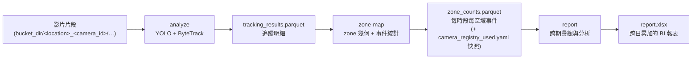

# video-flow-analytics

多路離線影片人流分析系統：以「一天」為單位，將多路攝影機的錄影，透過偵測、追蹤、
區域事件統計、報表彙總四道處理，轉換成可長期觀測的人流指標。

## 專案概述

本專案面向零售與空間場域的**離線批次**人流分析。輸入是多路攝影機一整天的錄影片段，
輸出是可供 BI 工具長期觀測的人流指標。整條處理拆成三個獨立階段：

1. **偵測與追蹤（analyze）**：以 YOLO 偵測畫面中的人、ByteTrack 做多路追蹤，產出每格
   的追蹤明細。
2. **區域事件統計（zone-map）**：把追蹤明細對映到各攝影機的區域（zone）幾何，轉化成
   「每時段、每區域」的事件統計。
3. **報表彙總（report）**：將區域事件統計跨期間彙總、分析，持續寫入單一 Excel 報表，
   供 Looker Studio 等 BI 工具接手做長期視覺化。

資料來源為**本機模擬的 GCS bucket 目錄**，各攝影機的片段依日期分層存放；攝影機清單與
區域定義集中在該 bucket 根目錄下的 `camera_registry.yaml`。三個階段刻意設計成彼此獨立、
可分別重跑，詳見下一節。

## 系統流程與資料流

三個階段之間**只透過檔案交接**，前一階段的輸出即後一階段的輸入（偵測與追蹤同屬 `analyze` 一段、走共享記憶體不落地成檔）：



三個階段共享三個設計原則：

- **階段獨立、可分別重跑**：三段的成本與觸發條件差異很大。只調整區域幾何時，僅需重跑
  `zone-map`；只調整報表參數時，僅需重跑 `report`——都不必重跑昂貴的 GPU 偵測。這讓
  日常迭代（改 zone、改報表粒度）維持在純 CPU 的低成本路徑上。
- **只靠檔案交接相依**：階段之間不透過記憶體或回傳值傳資料，而是靠 parquet 與 yaml 快照
  交接。下游以「上游輸出檔是否存在」判定相依是否滿足（例如 `zone-map` 檢查
  `tracking_results.parquet`）。因此任何排程器（orchestrator）都能個別重跑其中一個階段，
  只要對應的輸入檔還在。
- **重跑冪等**：所有輸出都先寫入 `.tmp` 暫存檔、完成後再 `rename` 成正式檔名，藉由
  `rename` 的原子性，確保過程中斷時不會在正式檔名下留下半成品。搭配 `report` 預設的
  `on_duplicate_date = "overwrite"`，同一個階段對同一天重跑天生冪等。

**進入點是函式呼叫，CLI 只是外殼。** 三個階段的核心分別是
`analyze_daily` / `map_zones_daily` / `export_report_daily` 三個函式；CLI 子命令只是從
`config.toml` 組出參數後呼叫它們。兩者分離，未來要換掉觸發方式（例如改由 Airflow 驅動）
時，只需替換呼叫這些函式的外殼，pipeline 本身不必更動。

## 環境需求

| 類別 | 需求 |
| --- | --- |
| 執行環境 | Python `>= 3.12`（`.python-version` 釘 `3.12`） |
| 套件管理 | [uv](https://docs.astral.sh/uv/)（安裝與執行皆透過 uv，倉庫附 `uv.lock`） |
| GPU | 選用。`analyze` 以 `torch.cuda.is_available()` 判斷，無 GPU 時 fallback 到 CPU（明顯變慢）；`zone-map` 與 `report` 為純 CPU |
| 系統相依 | FFmpeg / 影像編解碼器（OpenCV 解 `mkv` 等格式）；`lap` 為 C 擴充，環境無對應 wheel 時需要編譯工具鏈 |

執行期依賴（由 `uv sync` 安裝，各套件用途）：

| 套件 | 用途 |
| --- | --- |
| `opencv-python` | 影片片段讀取與標註影片輸出 |
| `ultralytics` | YOLO 偵測（會一併帶入 PyTorch） |
| `lap` | ByteTrack 的線性指派求解 |
| `numpy` | 向量化幾何運算（區域判定等） |
| `polars` / `pyarrow` | parquet 讀寫與資料彙總 |
| `pydantic` | 設定與 registry 的資料模型與驗證 |
| `pyyaml` | 讀取 `camera_registry.yaml` |
| `openpyxl` | 產出 Excel 報表 |

**模型權重**：`config.toml` 的 `model_path`（預設 `yolo26m.pt`）指向的權重檔不進版控
（`.gitignore` 排除所有 `*.pt`）；若本機找不到該檔，ultralytics 會自動下載對應權重。
（產品環境的權重存放策略不在本文件範圍。）

## 安裝與快速開始

```bash
uv sync
```

準備下列輸入後，依序執行三個階段即可產出報表：

1. 一份本機的 `bucket_dir/`，內含各攝影機的影片片段與 `camera_registry.yaml`（格式見
   [設定](#設定)）。
2. 倉庫根目錄的 `config.toml`（指定本次要跑哪個 bucket、哪一天、哪些攝影機與各項參數）。

```bash
uv run video-flow-analytics analyze    # 偵測 / 追蹤 → tracking_results.parquet（+ 標註影片）
uv run video-flow-analytics zone-map   # 區域事件統計 → zone_counts.parquet
uv run video-flow-analytics report     # 報表彙總 → report.xlsx
```

三個子命令本身不接受任何旗標，所有參數都讀自 `config.toml` 的對應區塊。

## 設定

設定分成兩個檔案，職責清楚切分：

- **`config.toml`** — 描述「這次要怎麼跑」（哪個 bucket、哪一天、各階段參數）。
- **`camera_registry.yaml`** — 描述「資料長什麼樣 ＋ 各攝影機的區域定義」。

### `config.toml`（本次執行參數）

置於倉庫根目錄。找不到此檔時，系統會印出警告並回退到各項預設值。範例：

```toml
[tracker]
track_high_thresh = 0.5
track_low_thresh = 0.1
new_track_thresh = 0.6
track_buffer = 30
match_thresh = 0.8
fuse_score = true
gmc_method = "none"

[model]
model_path = "yolo26m.pt"
batch = 8

[output]
save_video = true          # 是否輸出標註影片（開發 / 偵錯輔助）

[input]
bucket_dir = "bucket_name1"
date = 2026-05-01
camera_ids = []            # 空 = camera_registry.yaml 內全部攝影機

[zone]
bucket_minutes = 15        # 事件統計時間粒度（分鐘）
entry_debounce_frames = 1  # 進場去抖；1 = 不去抖

[report]
period_minutes = 60        # 報表彙總粒度；須為 zone.bucket_minutes 的倍數
metric = "entries"         # "entries" 或 "unique_visitors"
on_duplicate_date = "overwrite"  # "overwrite" / "append" / "error"
```

各區塊的主要欄位與約束：

| 區塊 | 欄位 | 預設 | 約束 / 說明 |
| --- | --- | --- | --- |
| `[tracker]` | ByteTrack 各項閾值 | 見範例 | `*_thresh` 皆介於 0–1，`track_buffer >= 1` |
| `[model]` | `model_path` | `"yolo26m.pt"` | 權重檔路徑 |
| | `batch` | `1` | YOLO 推理批次大小，`>= 1`（範例用 `8`） |
| `[output]` | `save_video` | `true` | 是否輸出標註影片（開發 / 偵錯用途） |
| `[input]` | `bucket_dir` | — | 本機模擬 GCS bucket 的根目錄 |
| | `date` | — | 分析日期 |
| | `camera_ids` | `[]` | 要分析的攝影機；空清單 = 全部 |
| `[zone]` | `bucket_minutes` | `15` | 事件統計時間粒度（分鐘），`>= 1` |
| | `entry_debounce_frames` | `1` | 連續在區域內幾格才算一次進場，`>= 1`；`1` = 不去抖 |
| `[report]` | `period_minutes` | `60` | 報表彙總粒度，`>= 1`，且**須為 `zone.bucket_minutes` 的倍數** |
| | `metric` | `"entries"` | `"entries"` 或 `"unique_visitors"` |
| | `on_duplicate_date` | `"overwrite"` | 同日期重跑的處理：`"overwrite"` / `"append"` / `"error"` |

### `camera_registry.yaml`（資料樣貌 ＋ 區域定義）

放在每個 `bucket_dir` 根目錄下，描述該 bucket 的攝影機清單與各攝影機的區域幾何。
**此檔不進版控**（隨 `bucket_name*/` 一起被 `.gitignore` 排除），需依實際部署環境人工維護。

攝影機片段的目錄結構為：

```
<bucket_dir>/<location>_<camera_id>/{YYYY}/{MM}/{DD}/{HHmmss}.{SSS}Z.mkv
```

> **時區備註（已知問題）**：檔名的 `Z` 尾綴排版沿用 RFC 3339，但實際錄影時鐘就是台北時間
> （UTC+8），系統解析時明確標記為 `Asia/Taipei`，下游不再對它做任何 UTC→+8 位移。此時區
> 處理方式為已知問題，**下一版本會調整**。

完整格式範例：

```yaml
bucket_name: bucket_name

storage:
  file_ext: mkv
  target_codec: h265
  segment_strategy: time
  segment_seconds: 1800

cameras:
  - camera_id: cam001
    location: test
    ip: 192.168.104.115
    participates_in_zone_mapping: true
    zones:
      - name: 平擺桌
        polygon: [[640.01, 866.83], [521.34, 938.8], [700.0, 1000.0]]
```

欄位規範：

| 層級 | 欄位 | 型別 | 預設 | 說明 |
| --- | --- | --- | --- | --- |
| 頂層 | `bucket_name` | str | 必填 | bucket 名稱 |
| | `storage` | 物件 | 必填 | 片段儲存格式參數（見下） |
| | `cameras` | list | 必填 | 攝影機清單 |
| `storage` | `file_ext` | str | `mkv` | 片段副檔名 |
| | `target_codec` | str | `h265` | 原始錄影編碼 |
| | `segment_strategy` | str | `time` | 分段策略 |
| | `segment_seconds` | int | `1800` | 每段秒數，`>= 1` |
| `cameras[]` | `camera_id` | str | 必填 | 攝影機代碼 |
| | `location` | str | 必填 | 地點名稱 |
| | `ip` | str | 必填 | 攝影機 IP |
| | `participates_in_zone_mapping` | bool | `true` | 是否參與區域事件統計 |
| | `zones` | list | `[]` | 該攝影機的區域定義 |
| `zones[]` | `name` | str | 必填 | 區域名稱 |
| | `polygon` | list | 必填 | 區域頂點 `(x, y)` 像素座標清單 |

使用限制（皆為 fail-loud，違反時直接報錯）：

- **`camera_id` 與 `location_camera_id` 皆須唯一**。兩者都是查詢字典的鍵，重複會靜默覆蓋
  其中一筆攝影機，因此在載入時即擋下。
- **`zone` 名稱須全域唯一**——不只同一攝影機內不可重複，跨攝影機也不可重複。因為報表以
  區域名稱（不含 `camera_id`）分組彙總，同名區域會被合併。此規則同時作用於 `zone-map` 與
  `report`：即使當天不產生報表，`zone-map` 也會擋下跨攝影機重複的區域命名。
- **`polygon` 至少需要 3 個頂點**才能構成區域，座標為對應攝影機固定解析度下的像素座標。
- **`participates_in_zone_mapping = false`** 時，`zone-map` 會直接跳過該攝影機，不看 `zones`
  內容。這是「是否參與區域統計」的正式訊號。
- `cameras[]` 與 `zones[]` 皆不接受未列出的欄位（多打的欄位會報錯）；`zones` 的幾何在
  `analyze` 階段刻意**不**驗證，僅在 `zone-map` 真正需要時才解析，避免區域定義的筆誤連帶
  影響不需要區域的偵測階段。

## 三大階段

三個階段各自獨立，以下逐一說明其職責、輸入輸出與函式介面。

### 階段一：`analyze`（偵測與多路追蹤）

- **職責**：逐日掃描各攝影機片段，以 YOLO（僅偵測 `person`）搭配 ByteTrack 做多路追蹤，
  `track_id` 跨片段延續。
- **輸入**：`bucket_dir/camera_registry.yaml` ＋ 當日各攝影機的影片片段。
- **輸出**：`tracking_results.parquet`（每格的追蹤明細）。此外，若 `output.save_video = true`，
  另輸出**逐片段標註影片**——標註影片定位為**開發 / 偵錯（Debug）輔助工具**，用來目視檢查
  偵測與追蹤結果，並非生產環境的主要產物。
- **函式介面**：`analyze_daily(date, bucket_dir, camera_ids=None) -> AnalysisResult`
  （回傳含 `date` / `camera_ids` / `tracking_results_path` / `output_video_paths`）。
- **運算特性**：GPU ＋ 多進程，是三個階段中成本最高的一段。
- **與其他階段的關聯**：唯一產出 `tracking_results.parquet` 的階段，是後續兩段的資料源頭。

### 階段二：`zone-map`（區域事件統計）

- **職責**：把追蹤明細與各攝影機的區域幾何結合，**轉化為事件統計**。以每個 track 的腳底
  中心點 `((x1 + x2) / 2, y2)` 做 ray-casting，判定是否落在區域多邊形內，再依 `time_bucket`
  聚合出每時段、每區域的兩項事件指標：
  - `unique_visitors`：該時段內在區域出現過的不重複 `track_id` 數。
  - `entries`：由「區域外 → 區域內」的轉換次數，`entry_debounce_frames` 控制去抖。

  本階段只負責「事件轉化」，**不做跨期間彙總或分析**（那是階段三的職責）。
- **輸入**：階段一的 `tracking_results.parquet` ＋ `camera_registry.yaml` 的區域定義（只納入
  `participates_in_zone_mapping = true` 的攝影機）。
- **輸出**：`zone_counts.parquet`，並將當下的 `camera_registry.yaml` 快照成
  `camera_registry_used.yaml`，供階段三以「產生此份資料時的定義」為準做驗證。
- **函式介面**：
  `map_zones_daily(date, bucket_dir, bucket_minutes, entry_debounce_frames=1) -> Path`。
- **運算特性**：純 CPU 向量化運算，不需重跑 GPU 偵測。

### 階段三：`report`（人流統計分析與 BI 報表）

- **職責**：**人流統計與分析歸屬本階段**。讀取區域事件統計，做跨期間彙總（將多個
  `bucket_minutes` 併成 `period_minutes`）、每日尖峰、用餐時段規則等分析。
- **輸出動機與行為**：將每日的統計結果**持續寫入（Append）**至同一個 `report.xlsx`，
  而非逐日各產一份。這樣設計是為了讓後續能對接 **Looker Studio 等 BI 工具**，對這份不斷
  累加的資料做長期觀測與視覺化分析。報表含「每小時人流」「每日尖峰」「活動事件」三個
  分頁；其中「活動事件」目前僅建立標題列、由其他來源填入，本階段不會寫入該分頁。
- **輸入**：階段二的 `zone_counts.parquet` ＋ 對應的 `camera_registry_used.yaml` 快照
  （以快照而非即時的 `camera_registry.yaml` 為驗證基準，避免事後改動區域命名造成靜默合併）。
- **函式介面**：`export_report_daily(date, bucket_dir, period_minutes, metric, on_duplicate_date, bucket_minutes) -> Path`。
- **運算特性**：純 CPU 運算，不需重跑偵測或區域統計。
- **注意事項**：
  - `on_duplicate_date` 決定同一天重跑的處理方式：`overwrite`（預設，先刪除既有相同日期
    的列再插入）、`append`（直接附加、不檢查）、`error`（發現重複日期即中止）。
  - **`metric = "unique_visitors"` 的彙總為近似值**：`unique_visitors` 是各 bucket 內的不重複
    人數，跨相鄰 bucket 停留的同一人會在彙總時被重複計入；`zone_counts.parquet` 未保留原始
    `track_id`，本階段無法在彙總時去重。`metric = "entries"` 本身即為可疊加的事件次數，
    不受此影響。

## 輸出檔案

| 路徑 | 內容 |
| --- | --- |
| `outputs/{bucket_name}/{date}/tracking_results.parquet` | 階段一：追蹤明細 |
| `outputs/{bucket_name}/{date}/…`（鏡射輸入路徑） | 階段一：逐片段標註影片（開發 / 偵錯輔助） |
| `outputs/{bucket_name}/{date}/zone_counts.parquet` | 階段二：每時段每區域事件統計 |
| `outputs/{bucket_name}/{date}/camera_registry_used.yaml` | 階段二：產生當日資料時的 registry 快照 |
| `outputs/{bucket_name}/report.xlsx` | 階段三：跨日累加的 Excel 報表（三個分頁） |

## 架構

### 套件結構

`src/video_flow_analytics/` 依職責分為數個子套件，依賴方向單向、無循環：

- **`core/`**：`config.py`（Pydantic 設定模型與全域 `settings` 單例）、`registry.py`
  （`CameraRegistry` / `CameraEntry` / `Zone`，讀 `camera_registry.yaml`）。不依賴其他子套件。
- **`io/`**：`video_reader.py`（逐日掃描片段、讀影格）、`video_writer.py`（標註影片輸出）、
  `frame_ring.py`（共享記憶體環形緩衝）。只依賴 `core`。
- **`visualization/`**：`visualizer.py`（`TrackAnnotator`，畫追蹤框）。
- **`analyze/`**：`detector.py` / `tracker.py` / `inference.py` / `pipeline.py` /
  `tracking_results.py`。依賴 `core`、`io`、`visualization`。
- **`zone_mapping/`**：`stats.py` / `pipeline.py`，獨立下游功能，只依賴 `core`。
- **`report/`**：`stats.py`（時區、期間彙總、尖峰、用餐時段規則）/ `pipeline.py`，
  獨立下游功能，只依賴 `core`。

`cli.py` 是唯一進入點，依子命令 lazy import 對應套件，讓 `zone-map` 與 `report` 不必載入
torch / ultralytics。

### `analyze` 的多進程 pipeline

`analyze_daily` 在主進程先 `discover_segments` 掃出當天片段、`probe_frame_shape` 讀首格解析度，
再以多進程拆成 N 個讀取進程 ＋ 1 個推理進程：

- **影格走共享記憶體、不走 pickle**（`frame_ring.py`）：每路一塊固定格數的環形緩衝
  （`mp.RawArray`），queue 只傳 slot 索引，避免每格影格逐格 pickle 的高成本。此設計**假設
  同一攝影機整天解析度固定**。
- **讀取進程**：無空 slot 時阻塞，形成對推理進程的天然背壓。**時間戳 = 該片段檔名時間 ＋
  片段內幀序 / fps**（逐段計算，不能用全日累計幀數推算）。
- **推理進程**：非阻塞輪詢各路 queue 湊批，維持 GPU 批次效率；每個 packet 依序經
  偵測 → 追蹤（每路各自獨立的 `BYTETracker` 實例）→ 累積追蹤結果 → 畫框 → 寫檔。
- **mp4v 編碼在背景執行緒**，與下一批 GPU 推理重疊。關檔順序有講究：某路尾端影格常與該路
  結束訊號同批出現，必須等這批全部寫完才關檔，否則背景緒會先收尾、之後補寫的影格會把檔案
  截斷。

### fail-loud 錯誤處理

- 檔名格式錯誤 → `discover_segments` 在主進程直接拋 `ValueError`；片段開檔 / 讀 FPS 失敗 →
  讀取子進程拋錯、以非零 exitcode 結束。
- `analyze_daily` 以 0.5 秒輪詢所有子進程；任一非零結束 → 先終止所有子進程再拋
  `RuntimeError`；`KeyboardInterrupt` → 終止後以 exit code 130 收斂。
- 追蹤結果 parquet 先寫 `.tmp`、全部串流結束後才 `rename` 成正式檔名（`rename` 具原子性）；
  中途例外則刪除 `.tmp`，正式檔名下不會出現不完整的 parquet。

本節為系統概觀。此倉庫另附一份 [CLAUDE.md](CLAUDE.md)，是給 Claude Code 的工作指引，含更細的
實作註記。

## 開發

```bash
uv run ruff check .     # lint（line-length = 88，select = ["E", "F", "I", "W"]）
uv run pytest           # 執行測試
```

> 測試現況：目前僅 `report` 模組有測試（`tests/report/`），其餘模組尚未建立測試。
