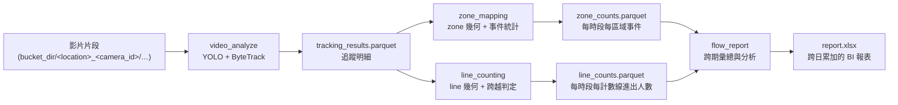

# video-flow-analytics

多路離線影片人流分析系統：以「一天」為單位，將多路攝影機的錄影，透過偵測、追蹤、
區域與計數線事件統計、報表彙總，轉換成可長期觀測的人流指標。

## 專案概述

本 repo 是**單一 uv workspace**（repo 根為 workspace root），由四個成員套件組成，
對應人流分析的各道處理階段。每個成員各帶自己的 `pyproject.toml`／`config.toml`／
`src/`／`tests/`，彼此**無跨資料夾 import**，只透過 `outputs/` 下的檔案交接；四包共用
的程式碼放在 [`libs/`](#共用-lib)，以 `{ workspace = true }` 引用：

| 套件 | 職責 | 運算特性 | 進入點 | 詳細文件 |
| --- | --- | --- | --- | --- |
| [`video_analyze/`](video_analyze/README.md) | YOLO 偵測 ＋ ByteTrack 多路追蹤，產出逐格追蹤明細 | GPU、多進程，成本最高 | `analyze_daily` | [README](video_analyze/README.md) |
| [`zone_mapping/`](zone_mapping/README.md) | 把追蹤明細對映到區域幾何，轉成每時段每區域事件統計 | 純 CPU 向量化 | `map_zones_daily` | [README](zone_mapping/README.md) |
| [`line_counting/`](line_counting/README.md) | 把追蹤明細對映到計數線幾何，轉成每時段每計數線的方向性進出人數 | 純 CPU 向量化 | `count_lines_daily` | [README](line_counting/README.md) |
| [`flow_report/`](flow_report/README.md) | 跨期間彙總分析，持續寫入單一 Excel 報表供 BI 工具接手 | 純 CPU | `export_report_daily` | [README](flow_report/README.md) |

`zone_mapping` 與 `line_counting` 的輸入相同，都以落腳點做純 CPU 向量化判定，差別在
幾何：zone 判「落腳點是否落在多邊形內」（區域佔用），line 判「落腳點是否跨越計數線及其
方向」（方向性進出）。

本 repo 原為單一套件 `src/video_flow_analytics/`，2026-07 拆成 `video_analyze`／
`zone_mapping`／`flow_report` 三包（issue #18），同月再收斂成 uv workspace
（issue #56），其後新增 `line_counting`（issue #41）。**各套件的完整實作細節（模組
結構、多進程 pipeline、fail-loud 處理、演算法、`config.toml` 完整欄位、函式介面）
以各自 README 為準**；本檔只提供跨套件的總覽與共用的資料格式。

資料來源為**本機模擬的 GCS bucket 目錄**，各攝影機的片段依日期分層存放；攝影機清單與
區域／計數線定義集中在該 bucket 根目錄下的 `camera_registry.yaml`。

## 系統流程與資料流

各階段之間**只透過檔案交接**，前一階段的輸出即後一階段的輸入（偵測與追蹤同屬
`video_analyze` 一段、走共享記憶體不落地成檔）：


```mermaid
flowchart LR
    V["影片片段<br/>(bucket_dir/&lt;location&gt;_&lt;camera_id&gt;/…)"]
    A["video_analyze<br/>YOLO + ByteTrack"]
    T["tracking_results.parquet<br/>追蹤明細"]
    Z["zone_mapping<br/>zone 幾何 + 事件統計"]
    C["zone_counts.parquet<br/>每時段每區域事件"]
    L["line_counting<br/>line 幾何 + 跨越判定"]
    N["line_counts.parquet<br/>每時段每計數線進出人數"]
    R["flow_report<br/>跨期彙總與分析"]
    X["report.xlsx<br/>跨日累加的 BI 報表"]

    V --> A --> T --> Z --> C --> R --> X
    T --> L --> N --> R
```

`zone_mapping` 與 `line_counting` 吃同一份 `tracking_results.parquet`，彼此獨立、可各自
重跑；`flow_report` 則同時讀兩者的輸出，把區域人流與出入口進出寫進同一份 `report.xlsx`。

各階段共享三個設計原則：

- **階段獨立、可分別重跑**：各段的成本與觸發條件差異很大。只調整區域或計數線幾何時，
  僅需重跑 `zone_mapping`／`line_counting`；只調整報表參數時，僅需重跑 `flow_report`
  ——都不必重跑昂貴的 GPU 偵測。這讓日常迭代維持在純 CPU 的低成本路徑上。
- **只靠檔案交接相依**：階段之間不透過記憶體或回傳值傳資料，而是靠 parquet 交接。因此
  任何排程器都能個別重跑其中一個階段，只要對應的輸入檔還在。相依是否滿足的判定
  分兩種：只有單一上游輸入的階段看「上游輸出檔是否存在」（例如 `zone_mapping` 檢查
  `tracking_results.parquet`）；`flow_report` 有兩個上游輸入，改由
  `bucket_dir/camera_registry.yaml` **的定義**決定該有哪幾份輸入——純看檔案無法區分「定義了
  計數線卻忘了跑 `line_counting`」與「這個 bucket 本來就沒有計數線」，前者會讓報表靜默
  少三個分頁。取捨見 [ADR-005](docs/adr/flow_report/005-report-input-requirement-from-snapshot.md)
  與 [ADR-007](docs/adr/shared/007-remove-registry-snapshot.md)（後者把資料來源由當日輸出目錄
  下的 registry 快照改為 `bucket_dir` 當下的檔案）。
- **重跑冪等**：所有輸出都先寫入 `.tmp` 暫存檔、完成後再 `rename` 成正式檔名，藉由
  `rename` 的原子性，確保過程中斷時不會在正式檔名下留下半成品。`flow_report` 對同一天重跑
  是否冪等，取決於 `on_duplicate_date`（見該套件 README）。

**進入點是函式呼叫，CLI 只是外殼。** 各階段的核心分別是 `analyze_daily`／
`map_zones_daily`／`count_lines_daily`／`export_report_daily` 四個函式；CLI 只是從各自的
`config.toml` 組出參數後呼叫它們。兩者分離，未來要換掉觸發方式（例如改由 Airflow 驅動）
時，只需替換呼叫這些函式的外殼，pipeline 本身不必更動。

## 環境需求

| 類別 | 需求 |
| --- | --- |
| 執行環境 | Python `>= 3.12`（`.python-version` 釘 `3.12`） |
| 套件管理 | [uv](https://docs.astral.sh/uv/)（安裝與執行皆透過 uv；單一 root `uv.lock`） |
| GPU | 選用。`video_analyze` 以 `torch.cuda.is_available()` 判斷，無 GPU 時 fallback 到 CPU（明顯變慢）；`zone_mapping`／`line_counting`／`flow_report` 為純 CPU |
| 系統相依 | FFmpeg / 影像編解碼器（OpenCV 解 `mkv` 等格式）；`lap` 為 C 擴充，環境無對應 wheel 時需要編譯工具鏈 |

各套件的執行期依賴與模型權重說明見各自 README；四包的推理堆疊與輸出格式相關套件版本
**pin 成彼此一致**，避免版本漂移造成非邏輯性的輸出差異。

## 安裝與執行

單一 `uv sync`，以 `uv run --package <pkg>` 執行各階段，依序產出報表：

```bash
uv sync --all-packages   # 全量同步（含 torch）；部署容器改用 `uv sync --package <pkg>`
                          # 只裝該包依賴子樹，維持 CPU-only 隔離（見「共用 lib」）

uv run --package video_analyze video_analyze   # 偵測 / 追蹤 → tracking_results.parquet
uv run --package zone_mapping  zone_mapping    # 區域事件統計 → zone_counts.parquet
uv run --package line_counting line_counting   # 計數線進出人數統計 → line_counts.parquet
uv run --package flow_report   flow_report     # 報表彙總 → report.xlsx
```

各命令不接受任何旗標，所有參數都讀自各套件根目錄的 `config.toml`。

> **一律在 repo 根目錄執行**：`bucket_dir` 與各套件的輸出根目錄 `outputs/` 皆為 **cwd
> 相對路徑**，`uv run --package` 不改變 cwd。若改在套件資料夾內執行（`cd zone_mapping
> && …`），`bucket_dir` 會對到不存在的路徑，`outputs/` 也會裂成四棵互不相通的樹，讓
> 階段間的檔案契約失效。各套件自己的 `config.toml` 則由 `find_project_root` 往上找
> `pyproject.toml` 定位，不受 cwd 影響。

## 設定

設定分成兩類檔案，職責清楚切分：

- **`config.toml`** — 描述「這次要怎麼跑」（哪個 bucket、哪一天、各階段參數）。**每包各有
  一份**，置於各套件根目錄，只含該階段實際讀到的區塊；找不到時會印警告並回退預設值。
  各區塊的完整欄位與約束見各套件 README。
- **`camera_registry.yaml`** — 描述「資料長什麼樣 ＋ 各攝影機的區域與計數線定義」。
  **全 repo 只有一份**，放在 `bucket_dir` 根目錄，四包讀同一份實體檔案（格式見下）。

### `camera_registry.yaml`（資料樣貌 ＋ 區域與計數線定義）

放在每個 `bucket_dir` 根目錄下，描述該 bucket 的攝影機清單與各攝影機的區域、計數線幾何。
**此檔不進版控**（隨 `bucket_*/` 一起被 `.gitignore` 排除），需依實際部署環境人工維護。

攝影機片段的目錄結構為：

```
<bucket_dir>/<location>_<camera_id>/{YYYY}/{MM}/{DD}/{HHmmss}.{SSS}Z.mkv
```

> **時區處理**：檔名的 `Z` 尾綴依 RFC 3339 為真正的 UTC，`video_analyze` 在
> `services/video_reader.py` 解析時即把它轉換成台北在地時間（`Asia/Taipei`，UTC+8）；此後
> `tracking_results.parquet` 的 `timestamp`、`zone_counts.parquet`／`line_counts.parquet`
> 的 `time_bucket`、`report.xlsx` 的日期／小時皆為台北在地時間，下游不需要、也不應該再
> 對它做任何 UTC→+8 位移。

完整格式範例：

```yaml
bucket_name: bucket_name1

storage:
  file_ext: mkv
  target_codec: h265
  segment_strategy: time
  segment_seconds: 1800

cameras:
  - camera_id: cam001
    location: test
    ip: 192.168.104.115
    participates_in_zone_mapping: true
    zones:
      - name: 平擺桌
        polygon: [[640.01, 866.83], [521.34, 938.8], [700.0, 1000.0]]
    lines:
      - name: 出入口161_左側
        points: [[1180.0, 980.0], [1180.0, 1080.0]]
        inside_point: [900.0, 1030.0]
        line_group: 4F賣場
```

欄位規範：

| 層級 | 欄位 | 型別 | 預設 | 說明 |
| --- | --- | --- | --- | --- |
| 頂層 | `bucket_name` | str | 必填 | bucket 名稱 |
| | `storage` | 物件 | 必填 | 片段儲存格式參數（見下） |
| | `cameras` | list | 必填 | 攝影機清單 |
| `storage` | `file_ext` | str | `mkv` | 片段副檔名 |
| | `target_codec` | str | `h265` | 原始錄影編碼 |
| | `segment_strategy` | str | `time` | 分段策略 |
| | `segment_seconds` | int | `1800` | 每段秒數，`>= 1` |
| `cameras[]` | `camera_id` | str | 必填 | 攝影機代碼 |
| | `location` | str | 必填 | 地點名稱 |
| | `ip` | str | 必填 | 攝影機 IP |
| | `participates_in_zone_mapping` | bool | `true` | 是否參與區域事件統計 |
| | `zones` | list | `[]` | 該攝影機的區域定義 |
| | `lines` | list | `[]` | 該攝影機的計數線定義 |
| `zones[]` | `name` | str | 必填 | 區域名稱 |
| | `polygon` | list | 必填 | 區域頂點 `(x, y)` 像素座標清單 |
| `lines[]` | `name` | str | 必填 | 計數線名稱 |
| | `points` | list | 必填 | 計數線頂點 `(x, y)` 像素座標清單，至少 2 點；多於 2 點即為可彎折的 polyline |
| | `inside_point` | list | 必填 | 場內參考點 `(x, y)`，決定方向：往這一側跨為「進」、反向為「出」 |
| | `line_group` | str | 必填 | 這條計數線所屬的範圍名稱（例如同一賣場的數個出入口） |

使用限制（皆為 fail-loud，違反時直接報錯）：

- **`camera_id` 與 `location_camera_id` 皆須唯一**。兩者都是查詢字典的鍵，重複會靜默覆蓋
  其中一筆攝影機，因此在載入時即擋下。
- **`zone` 名稱須全域唯一**——不只同一攝影機內不可重複，跨攝影機也不可重複。因為報表以
  區域名稱（不含 `camera_id`）分組彙總，同名區域會被合併。此規則同時作用於 `zone_mapping`
  與 `flow_report`：即使當天不產生報表，`zone_mapping` 也會擋下跨攝影機重複的區域命名。
- **`line` 名稱同樣須全域唯一**，理由與 zone 相同（下游依計數線名稱分組彙總，不含
  `camera_id`）。此規則同時作用於 `line_counting` 與 `flow_report`：即使當天不產生報表，
  `line_counting` 也會擋下跨攝影機重複的計數線命名。
- **`line_group` 則刻意不驗證唯一**——與 `name` 相反，同一個 `line_group` 本來就預期出現
  在不同攝影機底下，這正是分組的用途（一個範圍的數個出入口可能分屬不同攝影機）。`name`
  本身仍全域唯一，故 `(line_group, name)` 組合天然唯一。取捨見
  [ADR-002](docs/adr/line_counting/002-line-group-semantics.md)。
- **`polygon` 至少需要 3 個頂點**才能構成區域；**`points` 至少需要 2 個頂點**才能構成
  計數線，且不可有零長度線段（連續重複頂點）。兩者座標皆為對應攝影機固定解析度下的像素
  座標。
- **`inside_point` 不可落在任一段的無限延伸線上**，否則該段的側別無法定號、方向判定失效，
  載入時即報錯。
- **`participates_in_zone_mapping = false`** 時，`zone_mapping` 會直接跳過該攝影機，不看
  `zones` 內容。這是「是否參與區域統計」的正式訊號。**計數線沒有對應的旗標**：
  `line_counting` 以「`lines` 是否非空」決定該攝影機是否參與。
- `cameras[]`／`zones[]`／`lines[]` 皆不接受未列出的欄位（多打的欄位會報錯）；`zones` 與
  `lines` 的幾何在 `video_analyze` 階段刻意**不**驗證，僅在 `zone_mapping`／
  `line_counting` 真正需要時才解析，避免幾何定義的筆誤連帶影響不需要它們的偵測階段。

## 輸出檔案

各階段透過 `outputs/{bucket}/{date}/` 檔案交棒（`{bucket}` = `bucket_dir` 的目錄名）：

| 路徑 | 產出階段 | 內容 |
| --- | --- | --- |
| `outputs/{bucket}/{date}/tracking_results.parquet` | video_analyze | 追蹤明細；含 `foot_x`／`foot_y` 與 `frame_width`／`frame_height`（見下） |
| `outputs/{bucket}/{date}/zone_counts.parquet` | zone_mapping | 每時段每區域事件統計 |
| `outputs/{bucket}/{date}/line_counts.parquet` | line_counting | 每時段每計數線進出人數，欄位 `line_group`／`camera_id`／`line`／`time_bucket`／`in_count`／`out_count` |
| `outputs/{bucket}/report.xlsx` | flow_report | 跨日累加的 Excel 報表（六個分頁：區域兩頁、出入口三頁、活動事件一頁） |

**`tracking_results.parquet` 的影像尺寸欄位是跨套件的硬性契約**：`frame_width`／
`frame_height` 由 `video_analyze` 逐列寫入，供 `line_counting` 與 `zone_mapping` 把設定檔
的 1080p 基準像素換算成各攝影機的實際像素——兩者都是純 CPU 套件、部署時不掛載影片，只能
從這裡取得尺寸。缺這兩欄的舊 parquet 會被兩包直接擋下（不給「當成 1080p」的 fallback）。
取捨見 [ADR-004](docs/adr/shared/004-band-resolution-scaling.md)；`zone_mapping` 何時開始依賴
這兩欄見 [ADR-006](docs/adr/zone_mapping/006-zone-boundary-band.md)。

**落腳點欄位同樣是硬性契約**：`foot_x`／`foot_y`（人站在地面的位置）由 `video_analyze`
用 head 框推算後逐列寫入，`line_counting`／`zone_mapping` 與疊圖工具一律讀這兩欄、不再
各自從 bbox 現算——推算需要 head 框，而 head 不進追蹤結果（它若進 tracker，同一個人會多
出一條頭部軌跡）。缺這兩欄的舊 parquet 同樣被兩包擋下。公式、配對條件與多候選時的選法
見 [ADR-009](docs/adr/shared/009-head-based-foot-point.md)。

## 架構決策紀錄

技術決策記在 [docs/adr/](docs/adr/)，依影響的模組分子目錄：只動一個套件的放
`docs/adr/<套件名>/`（`video_analyze`／`zone_mapping`／`line_counting`／`flow_report`），
跨套件的放 `docs/adr/shared/`。狀態非 Accepted 者於表中註明。

| ADR | 影響範圍 | 主題 |
| --- | --- | --- |
| [001](docs/adr/line_counting/001-line-crossing-detection.md) | `line_counting` | 計數線的跨越判定方式，說明為什麼不能改成「整條線只有一個方向」 |
| [002](docs/adr/line_counting/002-line-group-semantics.md) | `line_counting` | 計數線群組（`line_group`）的語意，說明為何不驗證跨攝影機唯一 |
| [003](docs/adr/line_counting/003-finite-line-segment.md) | `line_counting` | 計數線的有效長度，在側別翻轉之外加一道「軌跡要真的穿過有限線段」的閘門（修正 ADR-001 的無限直線前提），並說明為何不採逐格有效性閘門 |
| [004](docs/adr/shared/004-band-resolution-scaling.md) | shared | 線段區域參數的尺規與影像尺寸來源，決定像素參數改以 1080p 為基準依 `frame_width` 換算，尺寸由上游寫進 parquet（而非人工填 registry 或下游讀影片 header） |
| [005](docs/adr/flow_report/005-report-input-requirement-from-snapshot.md) | `flow_report` | `flow_report` 的輸入必要性改由 registry 的定義決定（不看檔案在不在），說明為何刻意不留跳過用的旗標 |
| [006](docs/adr/zone_mapping/006-zone-boundary-band.md) | `zone_mapping` | `zone_mapping` 的 `entries` 由時間去抖改為線段區域＋Schmitt-trigger，說明為何 `unique_visitors` 刻意不吃這個黏著狀態、為何 zone 與 line 的幾何不可統一，並修訂 ADR-004 的「舊 parquet 不對稱」條款 |
| [007](docs/adr/shared/007-remove-registry-snapshot.md) | shared | 移除 `camera_registry_used.yaml` 快照機制，`flow_report` 改讀 `bucket_dir` 當下的 `camera_registry.yaml`，說明為何不補回溯替代方案、以及被接受的靜默錯位範圍（修訂 ADR-005 的資料來源） |
| [008](docs/adr/shared/008-config-section-namespace.md) | shared | 設定的頂層區塊名是跨四包的全域環境變數命名空間，`[input]` 因此由 `libs/vfa_config` 提供單一定義、欄位取聯集，說明為何不改用套件前綴、為何否決把 `bucket_minutes` 寫進 parquet metadata，並修訂「各包只保留自己讀到的區塊」那條 |
| [009](docs/adr/shared/009-head-based-foot-point.md) | shared | 落腳點由 head 框推算並上移成 `tracking_results.parquet` 的欄位，記錄多候選 head 的選法（規劃時的直覺判準被實測推翻）、為何 head 不能進 tracker、ADR-001／003／004／006 的判定輸入點定義隨之改變，以及**計數會大幅上升**（本機重跑 zone entries 最多 74 → 264） |
| [010](docs/adr/video_analyze/010-zero-copy-frame-lifetime.md) | `video_analyze` | 推理主迴圈免複製消費共享記憶體的畫面、slot 延後到整批推論後才歸還，記錄這條生命週期約束、`Results.orig_img` 是共享記憶體活別名的依賴（ultralytics 不保證，測試擋不住），以及環形緩衝格數為何改由 `model.batch` 推導 |


**取號規則**：編號是全域流水號，與子目錄無關；新增 ADR 一律取上表的下一號，不在各子目錄
內自行編號，因此單一子目錄內看到跳號是正常的（`shared/` 是 004、007、008、009）。理由是
編號被當成穩定識別碼在用——ADR 之間有修訂關係（007 修訂 005、006 修訂 004、003 修訂
001），外部 issue 與 PR 也直接引用這組號，各子目錄自行重編會讓這些引用失效。

## 共用 lib

四包共用的程式碼放在 `libs/`，是 workspace 成員，由四包以 `[tool.uv.sources]` 的
`{ workspace = true }` 引用：

| lib | 內容 | 誰在用 |
| --- | --- | --- |
| [`libs/vfa_registry/`](libs/vfa_registry/README.md) | `camera_registry.yaml` 的 Pydantic 模型與 zone／line 驗證 | 四包 |
| [`libs/vfa_observability/`](libs/vfa_observability/README.md) | 輸出單行 JSON 的 `StructuredLogger` | 四包 |
| [`libs/vfa_config/`](libs/vfa_config/README.md) | `[input]` 設定區塊的單一定義與 `config.toml` 定位 | 四包 |

workspace 為單一 `.venv`，`uv sync --package <pkg>` 只裝該包依賴子樹——`flow_report`／
`zone_mapping`／`line_counting` 不含 torch，維持 CPU-only；`uv sync --all-packages` 才裝
含 torch 的完整環境（開發機用）。

## 開發

各套件與各 lib 各自 lint 與測試
（`<pkg>` = `video_analyze` / `zone_mapping` / `line_counting` / `flow_report` /
`libs/vfa_registry` / `libs/vfa_observability` / `libs/vfa_config`）：

```bash
uv run --directory <pkg> ruff check .   # lint（select = ["E", "F", "I", "W"]；line-length 見各包 pyproject）
uv run --directory <pkg> pytest         # 執行測試
```

此處用 `--directory`（切換 cwd 進套件資料夾），pytest 才會解析到該套件的 `tests/`——
`--package` 不改變 cwd，會讓 pytest 從 repo 根遞迴收集到所有套件的測試而撞名衝突。
**改動 `libs/` 底下的程式碼時要跑該 lib 自己的測試**——四包的測試不涵蓋 lib 內部
（registry 的模型與 zone／line 驗證測試都在 `libs/vfa_registry/tests/`）。

此倉庫另附一份 [CLAUDE.md](CLAUDE.md)，是給 Claude Code 的工作指引，記錄跨套件、不易從
單一套件程式碼看出的設計決策。
